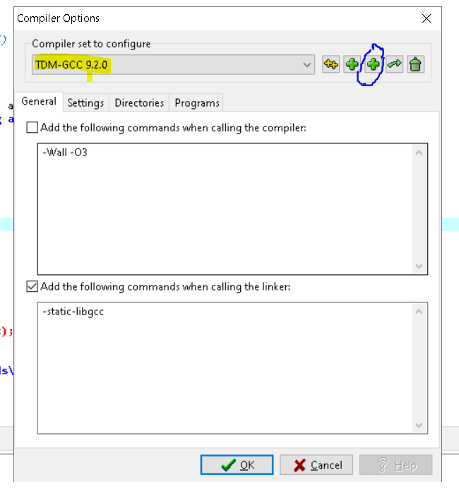
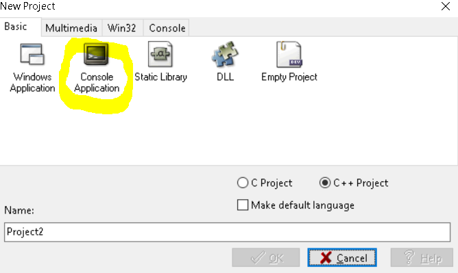

# disk-benchmark
A Benchmark and Simulation program to test Hard Drives, SSD Drives, HBAs, RAID Adapters &amp; Storage Controllers

Works for any Linux, POSIX or even MS DOs or Windows system as long as there is a C compiler!

With a single command line tool, you can evaluate the disk performance of you application scenario!

Benefit from this extremely simple tool by:
- Doing a simple benchmark test on you hard drive
- Monitor QoS of your cloud drive by constantly calclulating average performance summaries 
- Measure the disk performance of complex applications by doing a precise Read/Write simulation with multiple threads
- Create disk usage scenarios
- Monitor performance of disk replication.
- Monitor swap of active/passive disk RAIDS
.... all those from a simple opensource application of 650 lines of basic and very simple C code!


[Download it here](https://github.com/illumine/disk-benchmark/blob/master/bin/disk-benchmark.zip)
```
Size:	100,975
	CRC-32:	7D9F5FB6
	MD-5:	f6bcf6c2c387ade6a8287f806877d24f
```


## Synopsis

Use this Benchmark program to test any disk  physical or virtual, local or remote. This is a very light C program with the following features:
* Multi-threaded: can simulate concurrent read/writes from many threads
* Very fast: it utilizes lower system I/O `read()/write()` c-lib functions operating directly with buffers on a file descriptor. No JVM not even formatted - read/write. Nothing is faster than this. Can simulate easily MySQL I/O Operations, FTP/SFTP servers, Streaming Servers, Busy HTTP servers
* Supports many features, like random file size generation, random sleep time before read writes
* Supports write only mode
* Supports buffer size configuration during the test
* You can also preserve the files to check what has been written from threads.
* Per thread debug level on what has been written/read from disk
* In the end prints the summaries and average times from all threads.
* Prints some system level hints like buffer sizes
* Output CPU and Wall time for the operation timing.

## How it works

* You specify number of threads, thread read/write repeat times, file sizes 
* Program runs the thread, each of them performing times configured
* Each thread average and total times are printed
* Program stops threads and gather summary results 

## How to run
Run it without arguments to get the option lists:
<pre>
./disk-benchmark -p <path> -t <threads number> -r <repeats per thread>  -b <buffer size> -l <file size lower> -u <file size upper> -a <absolute file size>
 Makes a disk benchmark on <path> by creating <threads number> threads (default is 5 threads))
 Each thread first writes and then reads a file of size between <file size lower> and <file size upper> OR  <absolute file size>
 for <repeats per thread> times. Thread is reading/ writing the file using I/O buffer of <buffer size> bytes
 The resulting Time for Reading/Writing the file for each thread and summary results are printed.
 Other options
 -e <sleep seconds> Make each thread sleep for <sleep seconds> before attempt to read.
 -E <sleep sec min>:<sleep sec max> Make each thread sleep for randomly picked sec between <sleep sec min>:<sleep sec max> before attempt to read.
 -w Make each thread do write only.
 -n Make each thread NOT delete the sample files. MAKE SURE YOU HAVE ENOUGH SPACE if you turn this option!
 -B <write buff size>:<read buffer size> Make each thread write/read files with those buffer sizes.
 -x print values only. Use this to grab values for spreadsheets.
 -o Don't print clocks.
 -j Don't print scenario information.
 -h Don't print headers.
 -d print system local time also.
 -c work continuously. Blocks in a loop recreating threads without printing summaries. You have to interrupt with Cntrl-C
 -z <sleep seconds> Sleep interval time in seconds when work continuously. Setting this to something small, will default to high CPU load.
./disk-benchmark -s
 Prints information around system I/O. Use this info to set R/W buffer size for your tests with -b option.
 Writing to a file in smaller chunks may cause an inefficient read-modify-rewrite.
 Returns 0 on OK , 1 on Error.
 Author: Michael Mountrakis 2021 - mike.mountrakis[AT]gmail.com
Version v1.1  built on 7/2/2021

</pre>
 
## Default values
 * Thread number is 5
 * Buffer size for Read/Write set to system´s  `BUFSIZ`
 * File size minimum is 1024 Bytes
 * File size maximum is 10 KB
 
## Running a test

<pre>
# ./disk-benchmark  -p /monsoon/contentstore/ -t 10 -l 10000 -u 90000  -r 5  -E 2:10
path=/monsoon/contentstore/
threads=10  sleep sec between write/read = 0 repeats per thread=5 random pick sleep sec from [2 10]
Lower file size=10000 Upper file size=90000 Absolute file size=0 Read/Write buffer size=8192  Do write only=0 Delete files=1

Avg W=0.000295 Avg R=0.000121 Total W=0.001475 Total R=0.000603 Total Time=0.002078 Sleep=4.400000  Avg File Size =38878.000000
Avg W=0.000173 Avg R=0.001933 Total W=0.000863 Total R=0.009665 Total Time=0.010528 Sleep=4.800000  Avg File Size =59948.400000
Avg W=0.000124 Avg R=0.001928 Total W=0.000618 Total R=0.009640 Total Time=0.010258 Sleep=5.200000  Avg File Size =39912.000000
Avg W=0.000388 Avg R=0.000107 Total W=0.001942 Total R=0.000536 Total Time=0.002479 Sleep=6.000000  Avg File Size =61133.600000
Avg W=0.000143 Avg R=0.000090 Total W=0.000713 Total R=0.000452 Total Time=0.001166 Sleep=6.000000  Avg File Size =53212.000000
Avg W=0.000154 Avg R=0.000090 Total W=0.000771 Total R=0.000449 Total Time=0.001220 Sleep=6.200000  Avg File Size =50201.000000
Avg W=0.000344 Avg R=0.000117 Total W=0.001719 Total R=0.000584 Total Time=0.002303 Sleep=6.400000  Avg File Size =53158.000000
Avg W=0.000249 Avg R=0.002070 Total W=0.001246 Total R=0.010352 Total Time=0.011599 Sleep=6.400000  Avg File Size =74144.400000
Avg W=0.000303 Avg R=0.000112 Total W=0.001515 Total R=0.000561 Total Time=0.002075 Sleep=7.600000  Avg File Size =55071.200000
Avg W=0.000114 Avg R=0.000093 Total W=0.000568 Total R=0.000465 Total Time=0.001033 Sleep=7.800000  Avg File Size =55898.600000

Summaries - Averages all threads
Avg W=0.000229 Avg R=0.000666 Total W=0.001143 Total R=0.003331 Total Time=0.004474 Sleep=6.080000  Avg File Size =54155.720000
Wall time 39.000000, CPU time 0.010000
Finished
</pre>
In the first section it prints out your option. From what you can see in the example:
* 10 Threads are utilized
* Every thread will write and then read a file of random size between  10000 to 90000 bytes for 5 times
* Every thread will sleep for a random time between 2 to 10 seconds before it reads the file


In the second section, when all threads finish it will print the following *for each thread*:
* `Avg W` time in seconds: The time needed to `write()` the file 5 times 
* `Avg R` time in seconds: The time needed to `read()` the file 5 times 
* `Total W` time in seconds: The time needed to write the file 5 times
* `Total R` time in seconds: The time needed to read the file 5 times
* `Total Time` time in seconds: The time needed for write and read the file 5 times
* `Sleep` time in seconds: The average time the thread went to sleep during writing / reading the file for 5 times
* `Avg File Size` : average size in bytes of the file each of the thread created for 5 times


In the *last section*, when all threads finish the *all threads performance summary* is printed:
* `Avg W` time in seconds: The average time needed for  a single `write()` operation of all 10 threads
* `Avg R` time in seconds: The average time needed for  a single `read()` operation of all 10 threads
* `Total W` time in seconds: The average total time needed to  write the file 5 times from all 10 threads
* `Total R` time in seconds: The average total time needed to  read the file 5 times from all 10 threads
* `Total Time`  time in seconds: The average total time needed to  write and read the file 5 times from all 10 threads
* `Sleep` time in seconds: The average time all threads went to sleep during writing / reading the file for 5 times
* `Avg File Size` : average size in bytes of all files created by each thread 

Also timing of the overall operation
* `Wall time` is the number of seconds the entire operation lasted
* `CPU time` is the number of seconds the program run inside CPU - without calculating the thread sleep time.

## Examples of usage
Print I/O info
<pre>
 # ./disk-benchmark  -s

System I/O Block Site (stat.h : struct stat st_blksize) is 4096 bytes
System Buffer Size (stdio.h : BUFSIZ) is 8192 bytes
</pre>

Run a test of 10 threads each writing a file of size 100 * BUFSIZ with the default buffer size without reading the file. Each thread should sleep for some seconds randomly picked from the interval [2,10] sec.
<pre>
# ./disk-benchmark  -p /monsoon/contentstore/ -t 10 -a 81920 -E 2:10 -w
</pre>

Run a test of 30 threads each writing a file of size between the interval [10000,90000] bytes with a buffer size of 100 bytes with subsequent reading the file. Each thread should sleep for some seconds randomly picked from the interval [2,10] sec.
<pre>
# ./disk-benchmark  -p /monsoon/contentstore/ -t 40 -l 10000 -u 90000 -b 100  -E 2:10
</pre>

Run a continuous test of 10 Threads each writing and reading a file of 2MB on path /contentstore. Each time 
a thread will pause for 1 sec before read the file. Program will re-run every 6 seconds. Dont print headers, test info and output values only.<pre>
./disk-benchmark -p  /contentstore  -t 10 -a 2000000 -r 20 -x  -h -j  -z 6 -c
</pre>

## Avoid
Doing stupid things like:
<pre>
# ./disk-benchmark  -p /monsoon/contentstore/ -t 100 -a 90000000 -n -c -z 0 -b 100  
</pre>

In other words, put the benchmark to work continuously with 100 threads writing 90MB files *without deleting them* and no sleep interval using a buffer or 100 bytes.

Commands like this will kill your system in seconds especially when run as root. This particular example will:
* Full the disk under test in seconds
* Cause huge CPU load   uIn simple words: *Use this test tool at your own sake and risk!!!*


## Test Cases

### Test native Monsoon 2.0 Cloud ESX volumes:
Lets pick the / partition of a Monsoon 2.0 image:
<pre>
 # df -h
Filesystem                         Size  Used Avail Use% Mounted o
/dev/mapper/vg0-root                32G  1.1G   29G   4% /
</pre>

Scenario: 
We will create 10 threads each of them will write and then read a file of size 10.000.000 Bytes ( almost 10 MB) for 20 times.

<pre>
# ./disk-benchmark -p /root/tmp -t 10 -a 10000000 -r 20 
path=/root/tmp
threads=10  sleep sec between write/read = 0 repeats per thread=20 random pick sleep sec from [0 0
Lower file size=1024 Upper file size=10240 Absolute file size=10000000 Read/Write buffer size=8192  Do write only=0 Delete files=1
Avg W=0.045533 Avg R=0.019135 Total W=0.910665 Total R=0.382699 Total Time=1.293364 Sleep=0.000000  Avg File Size =10000000.00000
Avg W=0.044116 Avg R=0.025437 Total W=0.882325 Total R=0.508733 Total Time=1.391058 Sleep=0.000000  Avg File Size =10000000.00000
Avg W=0.049421 Avg R=0.018219 Total W=0.988420 Total R=0.364379 Total Time=1.352800 Sleep=0.000000  Avg File Size =10000000.00000
..
Avg W=0.055249 Avg R=0.021643 Total W=1.104971 Total R=0.432856 Total Time=1.537826 Sleep=0.000000  Avg File Size =10000000.00000
Avg W=0.054114 Avg R=0.020706 Total W=1.082273 Total R=0.414117 Total Time=1.496390 Sleep=0.000000  Avg File Size =10000000.000000
Summaries - Averages all thread
Avg W=0.050939 Avg R=0.018539 Total W=1.018786 Total R=0.370771 Total Time=1.389556 Sleep=0.000000  Avg File Size =10000000.00000
Wall time 2.000000, CPU time 3.51000
Finished
</pre>


### Test ESX extended volumes
This is a test on a logical volume created  from 2 ESX mounted native volumes.

<pre>
# This is the logical volume
# df -h
Filesystem                         Size  Used Avail Use% Mounted o
/dev/mapper/vol_grp1-logical_vol1   40G  2.4G   35G   7% /monsoon/contentstore
 # this volume is composed from volume group vol_grp
 # lvdisplay  /dev/vol_grp1/logical_vol
  --- Logical volume --
  LV Path                /dev/vol_grp1/logical_vol
  LV Name                logical_vol
  VG Name                vol_grp
  LV UUID                V66W74-SPJc-F2Sw-Tfqc-hV0Z-HS0I-bMqZN
  LV Write Access        read/writ
  LV Creation host, time mo-0bcd54f94, 2016-04-11 17:43:22 +000
  LV Status              availabl
  # open                 
  LV Size                39.99 GiB
  Current LE             10238
  Segments               
  Allocation             inheri
  Read ahead sectors     aut
  - currently set to     819
  Block device           253:
  
 # This group vol_grp1 consists of the following physical volumes - each of 20 GB
 
 # pvsca
  PV /dev/sdb    VG vol_grp1   lvm2 [20.00 GiB / 0    free
  PV /dev/sdc    VG vol_grp1   lvm2 [20.00 GiB / 0    free
  Total: 3 [99.70 GiB] / in use: 3 [99.70 GiB] / in no VG: 0 [0   ]
</pre>

Test the volume with the previous scenario

<pre>
 # ./disk-benchmark -p  /monsoon/contentstore  -t 10 -a 10000000 -r 20
...
Summaries - Averages all threadssAvg W=0.023361 Avg R=0.095913 Total W=0.467228 Total R=1.918250 Total Time=2.385478 Sleep=0.000000  Avg File Size =10000000.000000
Wall time 4.000000, CPU time 5.100000
</pre>

### Test GlusterFS replicated partitions
This test will be done to a replicated GlusterFS file system that is mounted from a remote device.
<pre>
ha-ma-rot1 root@mo-0bcd54f94:~ # gluster volume inf

Volume Name: contentstor
Type: Replicat
Volume ID: d300220c-d45b-41bc-94a6-47becc0cfa4
Status: Starte
Number of Bricks: 1 x 2 = 
Transport-type: tc
Bricks
Brick1: mo-0bcd54f94.mo.sap.corp:/monsoon/contentstor
Brick2: mo-4543f2f78.mo.sap.corp:/monsoon/contentstor

ha-ma-rot1 root@mo-0bcd54f94:~ # mkdir /contentstor
ha-ma-rot1 root@mo-0bcd54f94:~ # mount -t glusterfs   mo-4543f2f78.mo.sap.corp:/contentstore /contentstore
ha-ma-rot1 root@mo-0bcd54f94:~ # mount | grep cont
/dev/mapper/vol_grp1-logical_vol1 on /monsoon/contentstore type ext4 (rw,relatime,data=ordered
mo-4543f2f78.mo.sap.corp:/contentstore on /contentstore type fuse.glusterfs (rw,relatime,user_id=0,group_id=0,default_permissions,allow_other,max_read=131072)

ha-ma-rot1 root@mo-0bcd54f94:~ # df -h | grep con
/dev/mapper/vol_grp1-logical_vol1        40G   49M   38G   1% /monsoon/contentstor
mo-4543f2f78.mo.sap.corp:/contentstore   40G   49M   38G   1% /contentstor

ha-ma-rot1 root@mo-0bcd54f94:~ # ./disk-benchmark -p  /contentstore  -t 10 -a 10000000 -r 2

Summaries - Averages all threads
Avg W=1.742522 Avg R=0.293959 Total W=34.850432 Total R=5.879178 Total Time=40.729610 Sleep=0.000000  Avg File Size =10000000.00000

Wall time 42.000000, CPU time 5.5100
</pre>

## How to build

### Linux systems
You need  `gcc`, the GNU C Compiler 

You do:
<pre>
# git clone https://github.com/illumine/disk-benchmark
# cd disk-benchmark/src/
# gcc disk-benchmark.c -o disk-benchmark  -l pthread -lrt  -O3  -Wall
# ls -l disk-benchmark
-rwxr-xr-x 1 root root 23365 Apr 15 10:23 disk-benchmark
</pre>

Depends only on POSIX Threads library

Built and tested with `gcc version 4.8.3 20140911 (Red Hat 4.8.3-9) (GCC)`

### Windows - build with DDM-GCC

You can download Bloodshed DEV C++ tool from https://sourceforge.net/projects/orwelldevcpp/


This is a new and improved fork of Bloodshed Dev-C++ IDE with build in compiler TDM-GCC 4.9.2 32/64bit (very old) that offers very cool features.


Then, download the latest TDM-GCC compiler from https://jmeubank.github.io/tdm-gcc/download/ 


Install the latest TDM-GCC compiler inside the directory of Dev-C++ , for me it is `C:\Program Files (x86)\Dev-Cpp\TDM-GCC`


Install the newest TDM-GCC compiler in  Bloodshed DEV C++  by navigating to `Tools --> Compiler Options --> Select + Add compiler set by folder`
like the following picture shows:



Restart the  Bloodshed DEV C++ for changes to take effect, create a new project 



and add [the source file to it](src/disk-benchmark.c)


You can compile it by opening manu `Execute --> Rebuild All`

If you want to use only the binaries, I have prepared the 64-bit version of it here

[Download it here](https://github.com/illumine/disk-benchmark/blob/master/bin/disk-benchmark.zip)
```
Size:	100,975
	CRC-32:	7D9F5FB6
	MD-5:	f6bcf6c2c387ade6a8287f806877d24f
```

## Author
Michael Mountrakis mountrakis.AT.gmail.com

Version 1  - linux only - April 2021


Version 2  - Linux and Windows  - February 2021